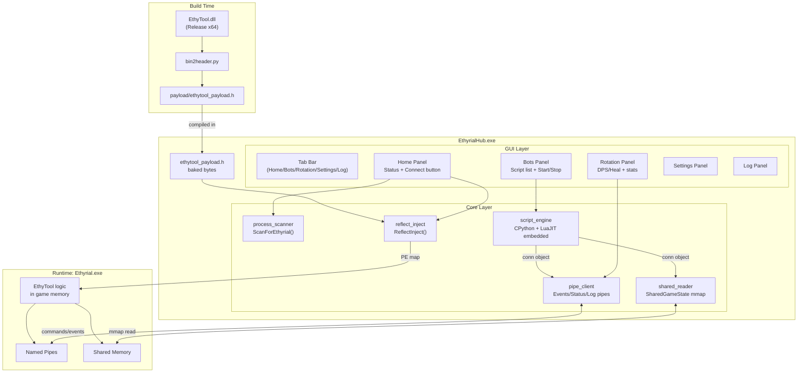

# EthyrialHub — All-in-One EXE

## What This Is

A single `EthyrialHub.exe` that replaces both the old injector EXE and the external Python dashboard. Everything lives inside:

- Built-in reflective DLL injection (EthyTool.dll baked as bytes — no file on disk)
- Live game state reader (shared memory + named pipes)
- Multi-language script engine (Python + Lua embedded, no user install)
- Full multi-tab GUI for bots, rotation, settings, log

## Architecture




## New Project Location


## File Structure

```
EthyrialHub/
├── EthyrialHub.sln
├── EthyrialHub.vcxproj
├── EthyrialHub.vcxproj.filters
├── EthyrialHub.rc               (manifest: requireAdministrator, version)
├── resource.h
├── main.cpp                     (WinMain, message loop, background threads)
│
├── core/
│   ├── process_scanner.cpp/.h   (ScanForEthyrial, CheckIL2CPP, OpenTargetProcess)
│   ├── reflect_inject.cpp/.h    (manual PE mapper — no LoadLibraryW)
│   ├── pipe_client.cpp/.h       (named pipe client: Events, Status, Log, IPC commands)
│   ├── shared_reader.cpp/.h     (mmap reader for SharedGameState)
│   └── script_engine.cpp/.h    (CPython + LuaJIT embedded runtimes + conn object)
│
├── gui/
│   ├── gui_framework.cpp/.h     (borderless Win32 window, tab bar, GDI drawing helpers)
│   ├── panel_home.cpp/.h        (Home: status orb, Connect btn, live HP/MP/combat)
│   ├── panel_bots.cpp/.h        (Bots: script list, per-script Start/Stop + inline log)
│   ├── panel_rotation.cpp/.h    (Rotation: DPS/Heal toggles, kills/heals/casts stats)
│   ├── panel_settings.cpp/.h    (Settings: thresholds, script path, build selector)
│   └── panel_log.cpp/.h         (Log: combined scrollable pipe + script output)
│
└── payload/
    ├── ethytool_payload.h        (auto-generated: g_payload[], g_payload_size)
    └── bin2header.py             (run after EthyTool DLL rebuild)
```

## GUI Design — Dark Hub

- Borderless window, custom title bar with drag, minimize, close buttons
- Left-side vertical tab bar with icon + label per tab
- Color scheme: `#0A0A0F` background, `#00C8FF` accent, `#1A1A2E` card panels, `#E0E0FF` text
- Animated status orb: grey=disconnected, amber=connecting, green=connected, red=error
- No "inject", "DLL", or technical terms — everything is "Connect", "Start", "Hub"

## Tab Breakdown

### Home

- Hub logo + title "ETHYRIAL HUB" at top
- Large status orb with text: "Waiting for Ethyrial" / "Connecting..." / "Connected" / "Error"
- **[Connect]** button triggers process scan + reflective injection
- If multiple game instances found: small inline picker (process name + PID)
- Live mini-readout once connected: HP bar, MP bar, job name, in-combat indicator

### Bots

- Scans configured scripts folder for `.py` and `.lua` files
- Each row: script name, language badge (PY/LUA), colored status dot, Start/Stop button
- Clicking a row expands an inline scrollable log for that script
- Scripts receive a `conn` object (Python) or `conn` table (Lua) wired to pipe_client + shared_reader
- Matches the existing `auto_rotation.py` API: `conn.get_hp()`, `conn.in_combat()`, `conn.do_rotation()`, etc.

### Rotation

- DPS / Heal toggle buttons (RotationEngine logic from `auto_rotation.py` runs inside script_engine)
- Live counters: Kills, Heals, Casts
- Class name display, combat indicator

### Settings

- Scripts folder path (browse button)
- HP/MP thresholds: HEAL_HP, REST_HP, EMERGENCY_HP, MANA_CONSERVE
- Tick rate slider
- Build profile selector (loads `enchanter.py`-style profile files)
- Saved to `%APPDATA%\EthyrialHub\settings.json`

### Log

- Combined scrollable output from all pipes + all running scripts
- Color-coded by source: teal=game events, white=status, yellow=log pipe, dim=script output
- Clear button + auto-scroll toggle

## Core Components

### reflect_inject.cpp

Manual PE map — no DLL file, no LoadLibraryW:

- `VirtualAllocEx` at preferred base, fallback to any
- Write PE headers + copy all sections
- Fix base relocations (`IMAGE_DIRECTORY_ENTRY_BASERELOC`)
- Resolve imports via in-process shellcode stub
- `CreateRemoteThread` → shellcode calls `DllMain(DLL_PROCESS_ATTACH)`

### pipe_client.cpp

Connects to EthyTool named pipes (post-injection):

- `\\.\pipe\EthyToolEvents_{PID}` — combat/target events
- `\\.\pipe\EthyToolStatus_{PID}` — status updates
- `\\.\pipe\EthyToolLog_{PID}` — log output
- Main IPC command pipe — JSON commands in, JSON responses out

### shared_reader.cpp

Reads `Local\EthyToolShared_{PID}` shared memory — same `SharedGameState` struct from `shared_state.h`. Zero-latency HP/MP/position reads for scripts.

### script_engine.cpp

Embeds CPython 3.11 (static) + LuaJIT 2.1 (static) — no runtime installs needed:

- Each script runs in its own thread with its own stop event
- `conn` object/table exposes the full existing game API
- `print()` output routes to Hub log + that script's inline log panel

## .vcxproj Configuration

- ConfigurationType: `Application`
- SubSystem: `Windows` (no console)
- Platform: x64, C++17, static CRT (`MultiThreaded`)
- AdditionalDependencies: `Psapi.lib; kernel32.lib; user32.lib; gdi32.lib; comctl32.lib; ws2_32.lib`
- Manifest: `requireAdministrator`
- Additional include/lib paths for CPython + LuaJIT static builds

## Build Workflow

```
1. Build EthyTool (Release|x64)   → EthyTool.dll
2. python payload/bin2header.py   → payload/ethytool_payload.h
3. Build EthyrialHub (Release|x64) → EthyrialHub.exe  (single file, ships alone)
```

